# 🏃‍♂️ Strava Assistant

> Your personal AI-powered Strava posting companion

**Automatically process running photos, generate engaging captions, and minimize the effort needed to share your runs on Strava.**

---

## 🎯 The Vision

Transform your Strava posting from a manual chore into an effortless, AI-powered experience. Perfect for busy professionals who run for fitness and stress relief but don't want to spend time crafting posts.

### The Problem We Solve

- **Manual caption writing** takes time and creativity
- **Photo organization** and geotagging is tedious  
- **Posting consistency** suffers when you're busy
- **Context is lost** - your amazing run deserves a great story

### The Solution

An intelligent system that:
1. **Watches** for new running photos and GPX data
2. **Matches** photos to GPS coordinates automatically  
3. **Analyzes** your running context (location, metrics, time)
4. **Generates** personalized, engaging captions
5. **Posts** to Strava with minimal user intervention

---

## ✨ Key Features

### 🤖 **AI Caption Generation**
- **Context-aware templates** for different run types
- **Time-based messaging** (morning energy, evening therapy)
- **Location intelligence** (park names, neighborhoods, trails)
- **Personal style** adaptation (including sales context)
- **Smart emoji** and hashtag selection

### 📸 **Automatic Photo Processing**
- **GPS coordinate embedding** using timestamp matching
- **Location name resolution** for human-readable context
- **EXIF data analysis** for photo metadata
- **Batch processing** of multiple photos per session

### 🗺️ **GPX Integration**
- **Activity metrics extraction** (distance, pace, elevation)
- **Route analysis** for terrain and difficulty assessment
- **Timestamp correlation** with photo capture times
- **Multiple format support** (GPX, TCX)

### ⚡ **Workflow Automation**
- **Real-time file monitoring** for new photos/GPX files
- **Session grouping** by time proximity
- **One-click posting** to Strava
- **Background processing** while you work

---

## 🏗️ System Architecture

```mermaid
graph TD
    A[📸 Running Photos] --> C[File Monitor]
    B[🗺️ GPX Data] --> C
    C --> D[Photo Processor]
    D --> E[GPS Matching]
    E --> F[Location Analysis]
    F --> G[AI Caption Generator]
    G --> H[Session Manager]
    H --> I[🚀 Strava MCP]
    I --> J[📱 Strava Post]
```



### Core Components

| Component | Purpose | Technology |
|-----------|---------|------------|
| **Photo Processor** | Geotag photos using GPX data | Python, exiftool, gpxpy |
| **Caption Generator** | AI-powered caption creation | Python, templating, location APIs |
| **Workflow Orchestrator** | Coordinate end-to-end automation | Python, watchdog, asyncio |
| **Strava MCP Server** | Direct Strava API integration | TypeScript, Model Context Protocol |
| **CLI Interface** | User interaction and control | Python argparse, rich output |

---

## 🚀 Quick Start

### Prerequisites

- **Python 3.8+** with pip
- **Node.js 18+** for Strava MCP server
- **exiftool** for photo processing
- **Claude Desktop** with MCP support
- **Strava API** application credentials

### Installation

```bash
# Clone the repository
git clone https://github.com/anthropics/strava-assistant.git
cd strava-assistant

# Run automated setup
python setup.py

# This will:
# ✅ Create Python virtual environment
# ✅ Install all dependencies
# ✅ Install exiftool via Homebrew
# ✅ Create necessary directories
# ✅ Provide MCP configuration instructions
```

### Strava API Setup

1. **Create Strava Application**
   - Visit [Strava API Settings](https://www.strava.com/settings/api)
   - Create new app with callback domain: `localhost`
   - Note your Client ID and Client Secret

2. **Complete Authentication**
   ```bash
   cd strava-mcp
   npx tsx scripts/setup-auth.ts
   # Enter your credentials and complete OAuth flow
   ```

3. **Configure Claude Desktop**
   ```json
   {
     "mcpServers": {
       "strava-mcp-local": {
         "command": "node",
         "args": ["/absolute/path/to/strava-assistant/strava-mcp/dist/server.js"]
       }
     }
   }
   ```

---

## 💡 Usage Examples

### Automatic Monitoring Mode

```bash
# Watch common directories for new files
python strava_assistant.py watch

# Watch specific directories
python strava_assistant.py watch --photos ~/Desktop ~/Downloads --gpx ~/Downloads
```

**What happens:**
- 🔍 Monitors directories for new photos and GPX files
- ⚡ Automatically processes when both are available
- 📝 Generates captions with location and metrics
- 📊 Creates session preview for review
- ✅ Queues for one-click Strava posting

### Manual Processing

```bash
# Process specific files
python strava_assistant.py process /path/to/photos /path/to/route.gpx

# List processed sessions
python strava_assistant.py list

# Post to Strava
python strava_assistant.py post session_20240919_143022
```

### Example Caption Output

**Input:**
- 📸 Photos from Golden Gate Park
- 🗺️ 5.2km run with 120m elevation
- ⏰ Evening run after work meetings

**Generated Caption:**
```
Post-meeting run therapy - 5.2k through Golden Gate Park to clear the head! 
Perfect way to end the day 🏃‍♂️ 🌲 💪

#running #strava #eveningrun #goldengatepark #sanfrancisco #5k
```

---

## 🛠️ Configuration

### Environment Variables

| Variable | Description | Example |
|----------|-------------|---------|
| `STRAVA_CLIENT_ID` | Your Strava app client ID | `12345` |
| `STRAVA_CLIENT_SECRET` | Your Strava app secret | `abc123...` |
| `STRAVA_ACCESS_TOKEN` | OAuth access token (auto-generated) | `xyz789...` |
| `STRAVA_REFRESH_TOKEN` | OAuth refresh token (auto-generated) | `refresh123...` |
| `ROUTE_EXPORT_PATH` | Directory for exported routes | `/Users/you/strava-exports` |

### Caption Customization

Edit `caption_generator.py` to customize:
- **Templates** for different run types
- **Emoji selection** based on context
- **Hashtag generation** rules
- **Sales context** integration
- **Personal style** preferences

### File Monitoring

Default monitored directories:
- **Photos**: `~/Desktop`, `~/Downloads`
- **GPX files**: `~/Downloads`
- **Output**: `~/strava-processed`

Customize in `strava_assistant.py` config section.

---

## 📁 Project Structure

```
strava-assistant/
├── 📄 README.md                    # This file
├── 🐍 requirements.txt             # Python dependencies
├── ⚙️ setup.py                     # Automated installation script
├── 🏃 strava_assistant.py          # Main workflow orchestrator
├── 📸 photo_processor.py           # Photo geotagging pipeline
├── 🤖 caption_generator.py         # AI caption generation
├── 🔗 strava-mcp/                  # Strava MCP server
│   ├── 📦 package.json
│   ├── 🔧 scripts/setup-auth.ts
│   └── 🏗️ dist/server.js
├── 📁 sessions/                    # Processed session data
├── 📁 processed/                   # Archived results
└── 🗃️ venv/                       # Python virtual environment
```

---

## 🔄 Workflow Deep Dive

### 1. **File Detection**
- Real-time monitoring using `watchdog`
- Triggers on new `.jpg`, `.png`, `.heic`, `.gpx` files
- Smart filtering to avoid processing system files

### 2. **Session Grouping**
- Groups photos and GPX by timestamp proximity (±2 hours)
- Handles multiple photos per run session
- Manages concurrent processing

### 3. **Photo Processing**
- Extracts EXIF timestamps for correlation
- Matches to closest GPX trackpoint (±30 seconds)
- Embeds GPS coordinates using `exiftool`
- Resolves human-readable location names

### 4. **Activity Analysis**
- Calculates distance, pace, elevation from GPX
- Determines run type (morning, evening, challenging, scenic)
- Analyzes route characteristics and terrain

### 5. **Caption Generation**
- Selects appropriate template based on context
- Populates with location, metrics, time data
- Adds contextual emojis and hashtags
- Incorporates personal style elements

### 6. **Strava Integration**
- Uses MCP for secure API communication
- Handles photo uploads and activity creation
- Manages OAuth token refresh automatically
- Provides posting confirmation and error handling

---

## 🎨 Caption Examples

### Morning Run
```
Started the day right with a 6.2k run through Presidio! 
Beautiful crisp morning 🌅 👟 💪

#running #strava #morningrun #presidio #sanfrancisco
```

### Scenic Trail Run
```
When your running route looks like this, you know you're doing something right! 
8.5k of pure beauty in Marin Headlands 🏃‍♂️ 🏔️ 🔥

#running #strava #scenicrun #marinheadlands #trailrunning
```

### Post-Work Decompression
```
From boardroom to Golden Gate Park - 5k of decompression 
Perfect evening therapy session 🏃‍♂️ 🌲 😊

#running #strava #eveningrun #worklifebalance #goldengatepark
```

---

## 🔧 Troubleshooting

### Common Issues

**Photos not geotagging:**
- ✅ Ensure `exiftool` is installed: `brew install exiftool`
- ✅ Check photo timestamps are within ±30 seconds of GPX data
- ✅ Verify GPX file contains valid trackpoints

**MCP connection fails:**
- ✅ Use absolute paths in Claude configuration
- ✅ Restart Claude Desktop after config changes
- ✅ Verify Strava tokens are valid and not expired

**Caption quality issues:**
- ✅ More location data improves caption context
- ✅ GPS accuracy affects location name resolution
- ✅ Customize templates for personal style

### Debug Commands

```bash
# Test photo processing
python photo_processor.py /path/to/photos /path/to/route.gpx

# Test caption generation
python caption_generator.py processed_data.json

# Check MCP server status
cd strava-mcp && npm run build && node dist/server.js
```

---

## 🛡️ Privacy & Security

- **Local processing** - All data stays on your machine
- **Secure OAuth** - Industry-standard Strava authentication
- **No cloud uploads** - Photos and GPX never leave your device
- **Encrypted tokens** - Strava credentials stored securely
- **Optional sharing** - You control what gets posted

---

## 🚀 Future Enhancements

### Planned Features
- [ ] **Advanced photo analysis** using computer vision
- [ ] **Weather integration** for enhanced context
- [ ] **Training plan awareness** for workout-specific captions
- [ ] **Social media crossposting** (Instagram, Twitter)
- [ ] **Achievement detection** (PRs, milestones)
- [ ] **Group run recognition** from multiple GPS tracks

### Technical Improvements
- [ ] **Real-time preview** in web interface
- [ ] **Mobile app** for on-the-go posting
- [ ] **Cloud sync** for multi-device workflows
- [ ] **Advanced AI models** for better caption quality
- [ ] **Plugin architecture** for custom processors

---

## 🤝 Contributing

We welcome contributions! Areas where help is needed:

- **Caption templates** for different running styles
- **Location intelligence** improvements
- **Photo analysis** enhancements  
- **Additional GPS formats** support
- **Mobile integration** development
- **Documentation** and tutorials

### Development Setup

```bash
# Fork and clone the repository
git clone https://github.com/your-username/strava-assistant.git

# Create development environment
python -m venv dev-env
source dev-env/bin/activate
pip install -r requirements.txt -r requirements-dev.txt

# Run tests
python -m pytest tests/

# Format code
black . && isort .
```

---

## 📄 License

MIT License - see [LICENSE](LICENSE) for details.

---

## 🙏 Acknowledgments

- **Strava API** for providing comprehensive activity data access
- **Model Context Protocol** for enabling secure AI-tool integrations
- **Claude Desktop** for MCP server hosting capabilities
- **ExifTool** for reliable photo metadata processing
- **GPXPy** for robust GPX file parsing

---

<div align="center">

**Ready to make your Strava posts effortless?**

[🚀 Get Started](#-quick-start) | [📖 Full Documentation](#-usage-examples) | [🤝 Contribute](#-contributing)

---

*Built with ❤️ for runners who code and coders who run*

</div>